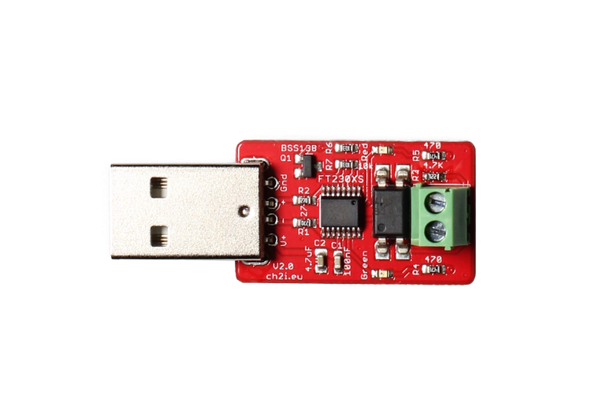

# HAEnedisLinky

A Home assistant custom component to read Enedis Linky teleinformation

This project adds a "EnedisLinky" integration to Home Assistant server. The integration is able to read in real time the TIC TeleInfomation sent by the Enedis Linky device. The data is then published into Home Assistant entities.

The integration can be used with a [USB adapter](https://www.tindie.com/products/hallard/micro-teleinfo-v20/)  that convert the signal received from French dedicated energy meter Teleinfo to serial data. 

The integration can be used from the HA gui. Simply select the usb adapter within the proposed list and confirm. A linky device will be created and will gather all the loaded entities. 